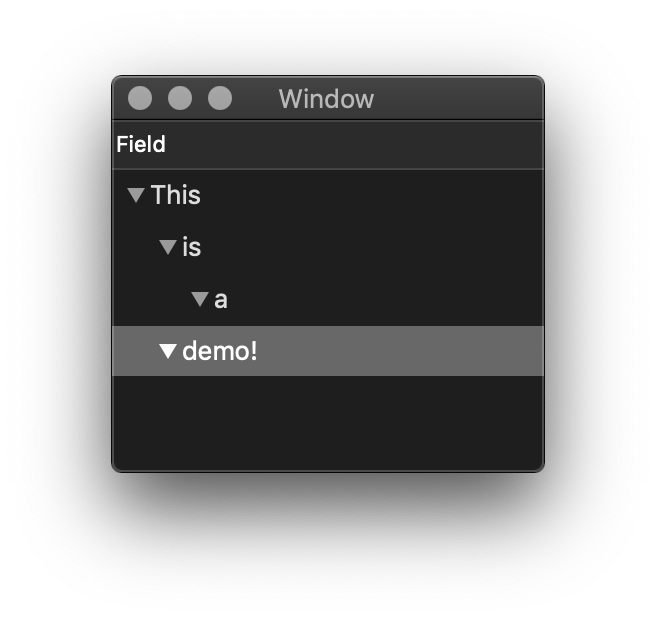

OT4
====
A value based outline-view.
Eonil, May 2019.

This is one of trials to make `AppKit` less painful.
Using Apple `AppKit` is painful even for Apple fanatics,
and one of the most painful point is `NSOutlineView`.
As like other classes in `AppKit`, this class is designed
as a half-finished assembly, and you need to implement
the other half to use without pain. Apple's original 
answer for convenience was `NSTreeController`,
but IMO, it is not the solution.

Here OT4 is in rescue!
--------------------------
OT4 provides clean value-based idempotent rendering. 
For the simplest case, you just build a tree and pass it
to `OT4SnapshotView`. Here's an over-simplified example.

    let v = OT4SnapshotView<OT4KeyValueTree>
    var s = OT4KeyValueTree(key: 111, value: "top") 
    s.subtrees.append(OT4KeyValueTree(key: 222, value: "first")
    s.subtrees.append(OT4KeyValueTree(key: 333, value: "second")
    s.subtrees.append(OT4KeyValueTree(key: 444, value: "third")
    v.control(.render(s))
    
    // Done!

Rendering same value yields same result.

    v.control(.render(s))
    v.control(.render(s))
    v.control(.render(s))

    // Same result.

You also can track selections.

    v.note = { [weak self] n 
        switch n {
        case .interaction(let ix):
        let ids = Array(ix.selectedIdentities)
        print("selected: \(ids)")
    }

You gonna see something like this.

    selected: [111]
    selected: [222]
    selected: [444]

Slow? Consider `OT4View` 
-------------------------------
There's one problem with `OT4SnapshotView`. Rendering a 
snapshot always takes `O(n log n)` time where `n` is total 
number of nodes in the tree. If it's a problem for you, please 
use `OT4View` class. Which implements better difference 
tracking at lower time but with more difficult value build-up.

    typealias Source = OT4Source<Int,String>
    typealias View = OT4View<Source,OT4ItemView<String>> 
    let v = View()
    var s = Source() 
    s.timeline.insert("This", for: 1, at: [])
    s.timeline.insert("is", for: 2, at: [0])
    s.timeline.insert("a", for: 3, at: [0,0])
    s.timeline.insert("demo!", for: 4, at: [1])
    v.control(.render(s))

    // Done!

You'll get this.

Safety
--------
`OT4SnapshotView` and `OT4View` provide full type-safety.
You don't need to worry and check types becuase compiler
will do the job for you. Also as it is fully type annotated,
your IDE can provide nice auto-completion support.

Performance
----------------
In my benchmark, `OT4View` performs at 1,000 ops/s with 
100,000 existing items. Single operation takes about 1ms to 
finish. It seems major bottleneck is in my HAMT implementation.

But It Does Not Cover Everything
----------------------------------------
Some features of `NSOutlineView` is context-sensitive, therefore
cannot be represented as value. For example, there's `clickedRow`
property. When you open a context-menu on a node, this property
provides end-user clicked-row, but only at the moment, and
disappears immediately.
Therefore, I cannot support the feature. Therefore, `OT4View` also
provides some members to access such features synchronously.

License & Credits
----------------------
This code is licensed under "MIT License".
Contributions will also be under "MIT License".
Copyright Eonil, Hoon H.. 2019.
